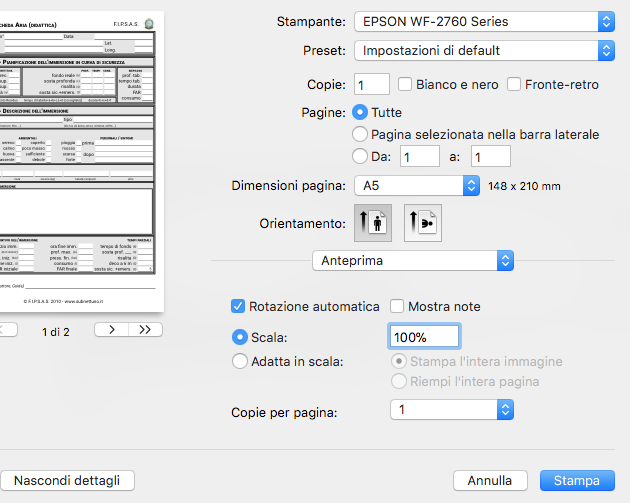

# Logbook templates

A template system for you diving log applications.

Suppoted formats:

- [MacDive][macdive] XML Export
- [DivingLog][divinglog] XML Export

Supported templates:

- [logbook F.I.P.S.A.S.][fipsas] Nettuno

## Usage

1.  Export your dives from you log application of choice in xml
2.  Launch from a terminal

    ```sh
    logtemplate <file>

    # logtemplate diving.xml
    ```

A pdf file with all the dives rendered would be the output. The default name will be `export.pdf` but it can be customized with the `--dest` option

To see all the options please run

```sh
logtemplate --help
```

# Stampa

1.  Stampare il html in pdf senza margini
2.  Per stampare il PDF scegliere il formato di carta A5 e impostare la scala al 100%
3.  Stampare solo i fogli dispari, girare e quindi i fogli pari.
    

[divinglog]: http://divinglog.de/
[macdive]: http://www.mac-dive.com/
[fipsas]: http://www.fipsas.it/didattica/didattica-subacquea/documenti-didattica-subacquea/logbook
[node]: https://nodejs.org
